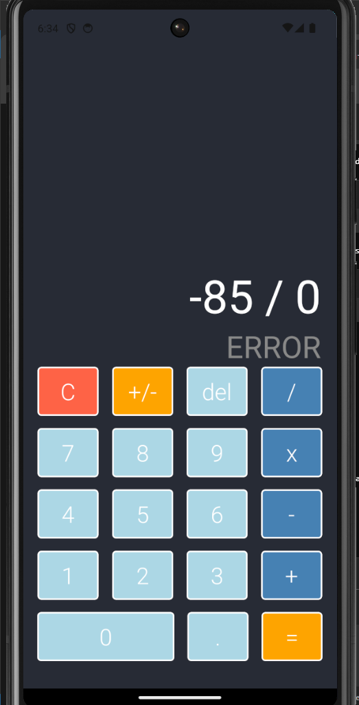

# Calculadora_Rutkat_Zynda-Kevin

## Calculadora

## Autor
Kevin Rutkat Zynda

## Instrucciones para ejecutar la aplicación
1. Clona el repositorio de GitHub.
2. Entra en el directorio del proyecto.
3. Instala dependencias.
4. Ejecuta la aplicación mediante una terminal escribiendo `npm run start`.
5. Cuando cargue, pulsa `a` para ejecutar tu emulador de Android.

## Captura de pantalla

